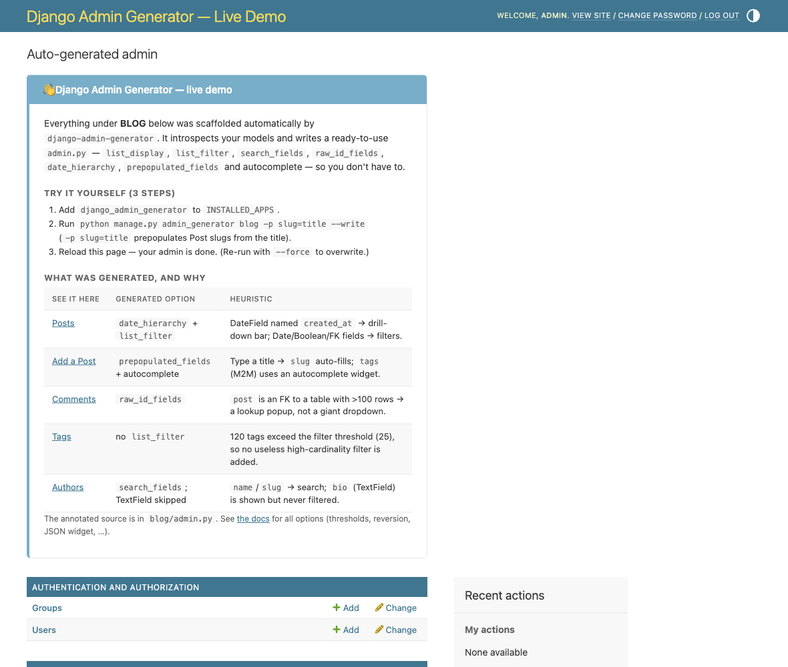
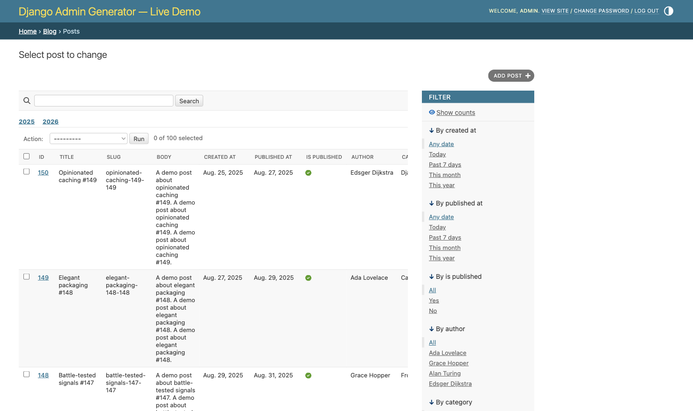
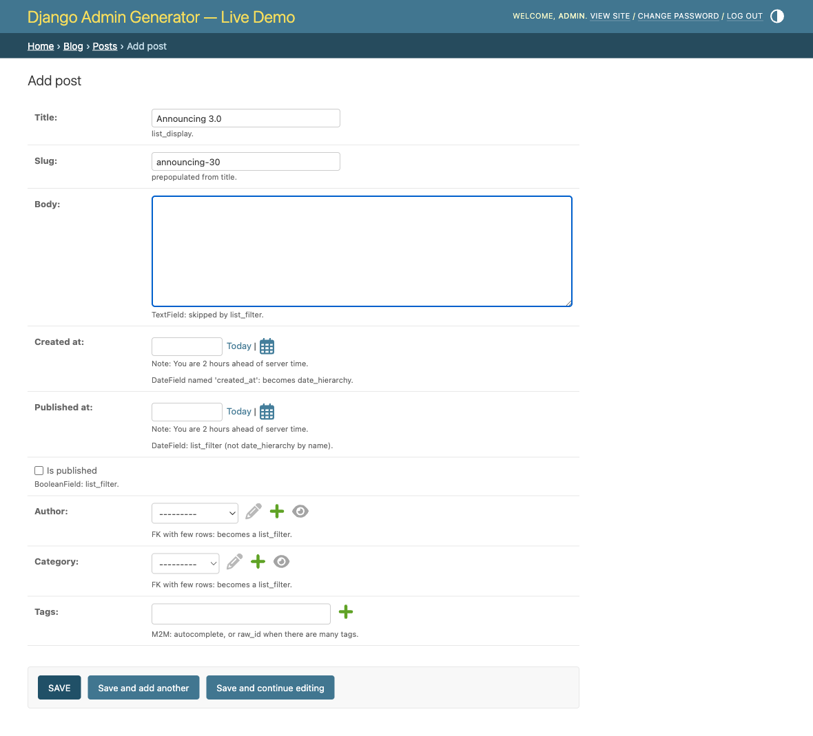

Live demo
=========

The repository ships a small blog project whose entire ``admin.py`` is
generated. It is the fastest way to see the heuristics act on realistic data
rather than on three toy models.

Run it
------

From a checkout:

.. code-block:: console

    tox -e demo

or, without tox:

.. code-block:: console

    uv run --extra demo python test_project/manage.py demo

The command migrates, seeds a few hundred posts, comments, authors and tags,
and serves the admin at http://127.0.0.1:8000/admin/.

What to look at
---------------

The index page explains what the generator produced for each model and which
rule produced it.

The changelist is where the row counts show their work. Small relations became
sidebar filters, the seeded posts stayed under the date hierarchy threshold,
and the slug column is searchable because of its name.

The change form is the half that is easy to forget. Slugs prepopulate from
titles, tags autocomplete instead of rendering a multi-select, and JSON
columns get a real editor.

Regenerate it
-------------

The demo's admin file is not special. Regenerate it and compare:

.. code-block:: console

    uv run --extra demo python test_project/manage.py admin_generator blog

``test_project/README.md`` in the repository walks through the models and what
each one is there to demonstrate.
